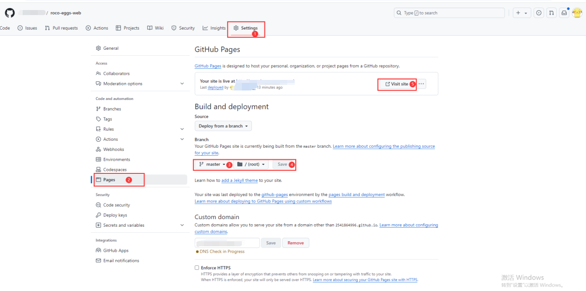
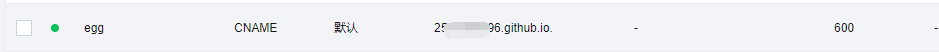
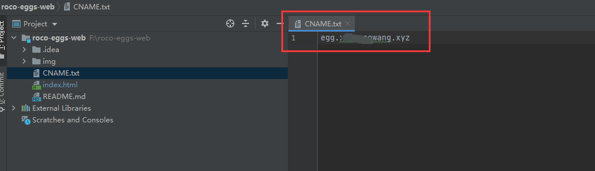
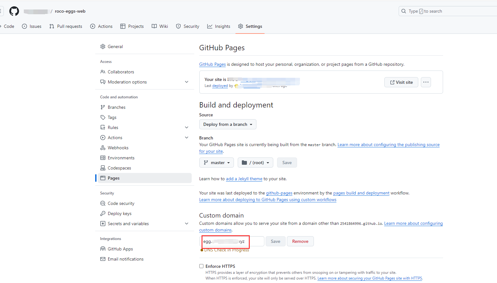

### 部署静态页面


### 添加域名解析 类型CNAME 值为github的访问路径


### 创建CNAME.txt文件 内容为访问域名


### 配置自定义域名


### 代码同步到github
```cmd
git remote add github https://github.com/your_username/your_github_repo.git
git push github master
```